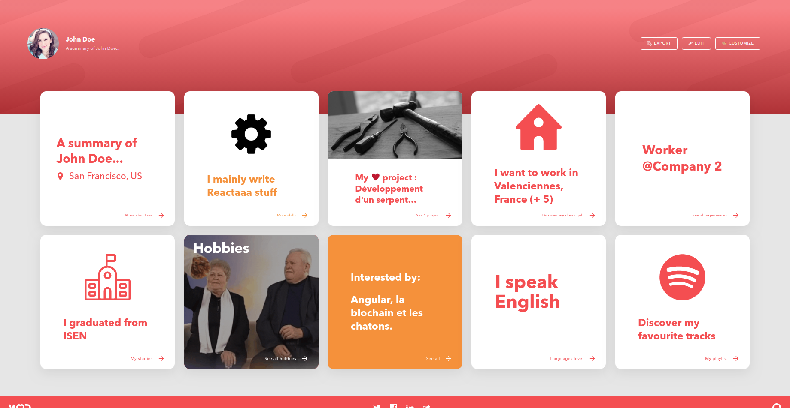

# A React Portfolio

This resume is a simple material design portfolio that learns from the open-source resume [WeLoveDevs.com](https://github.com/welovedevs/react-ultimate-resume) and it is custimized by Yelin Liu. This document is also a step-by-step record of building a resume using React.

## Preview

## Component Hierarchy
- App
    - Header
        - Intro
        - Contact
    - Main
        - Card
        - Card
    - Footer
        - Media

## Rules
1. use the BEM css nameing convention in css

 

